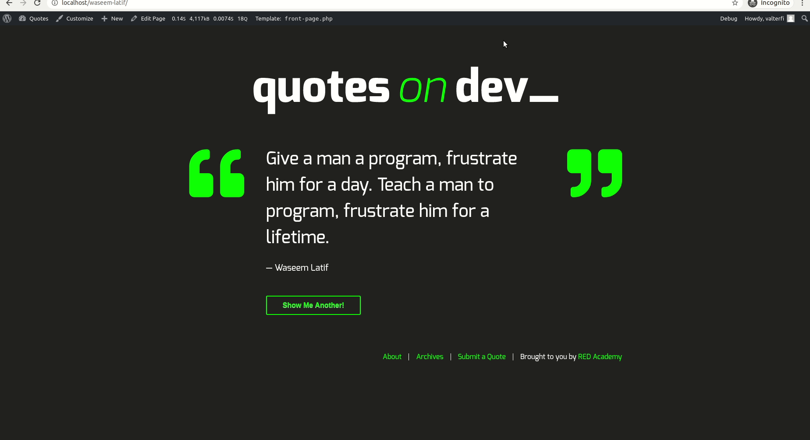
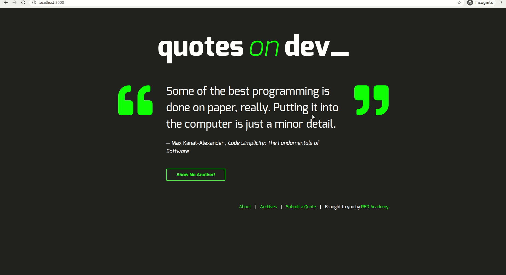

# quotes-on-dev

- Implementation of a theme for wordpress using php, html, css and javascript.

# Development approach

- First of all it was to develop all the requests for the wordpress rest api working correctly.
- Then develop the application style with the mobile-first approach.
- To customize the pages, I followed the style sheet on the website https://quotes.academy.red/. However, I had to make some changes to adapt to the way I was implementing it.
- I versioned all the plugins that were used in the development of this theme.

# Main implementation challenges

- Develop a responsive wordpress application.

- Take a random quote and update it on the screen only using javascript without having to redirect to the quote page.

- In the link to login on the submit a quote page redirect the same page with the form available to be submitted

